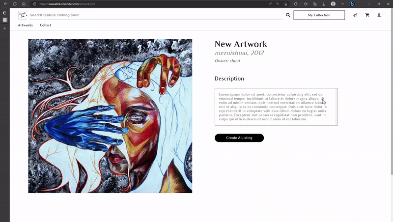
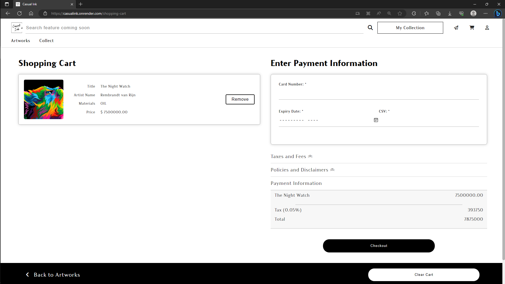
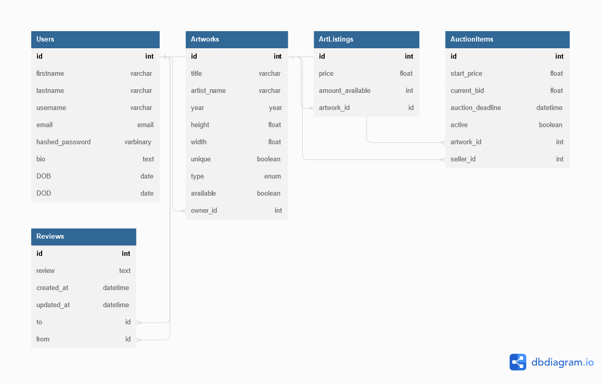

# CasualInk
CasualInk is a clone of Artsy, a website that provides a platform for people to list artwork for sale/auction. Visitors can view, bid on, and buy artwork that they like. CasualInk is built on a Python backend and connected to a PostgreSQL database. Websockets are utilized in order to perform bidding and updates for all users in real time.

In order to run this in local environment, clone the repo, and run ```pipenv install``` in the root directory, and ```npm install``` in the "react-app" directory.
To start the backend, run ```pipenv shell```, and then ```flask run```. To reseed the database, while inside the virtual environment, run ```flask seed undo``` and ```flask seed all```.
To start the frontend, run ```npm start``` within the "react-app" directory.


Link to Live Site: https://casualink.onrender.com/

Link to GitHub Repo: https://github.com/usr1l/CasualInk

## Technologies Used

### Languages

- JavaScript
- HTML
- CSS
- DBML
- Python

### Frameworks
- React
- Flask

### Libraries
- Redux
- SQLAlchemy

### Databases
- SQLite3
- SQLAlchemy

### Tools
- Postman
- GitHub
- Visual Studio Code
- Redux Developer Tools

## Features

### Art Pieces
Browse and explore


### Shopping Cart


### Reviews


### Live Bidding


## Components
- Art Display Card
- Art Showcase Card/Display Card
- Auction Bid Input
- Button
- Confirm Modal
- Content Card
- Countdown Timer
- Feature Banner
- Horizontal Showcase
- Icon Label
- Image Card
- Image Preview
- Input Div
- NavBar
- Open Modal Button
- Page Container
- Page Split
- Profile Description Card

## Database Design


## Link to Preparation Docs
https://github.com/usr1l/CasualInk/wiki
