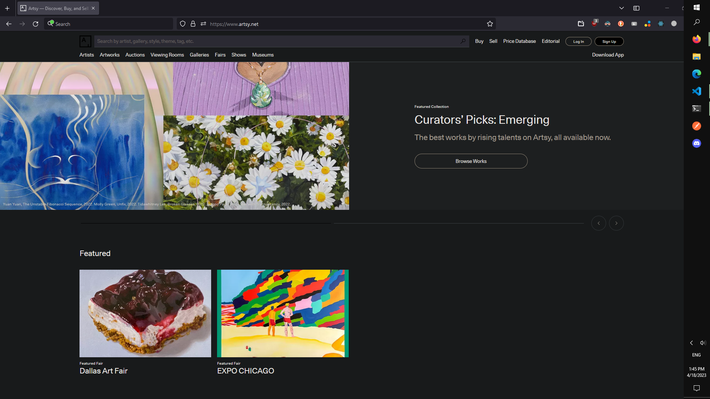
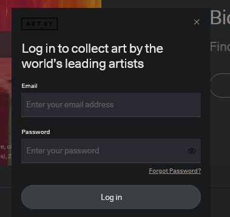
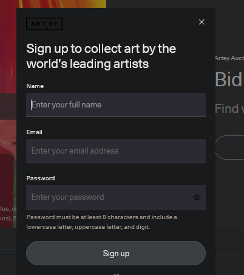
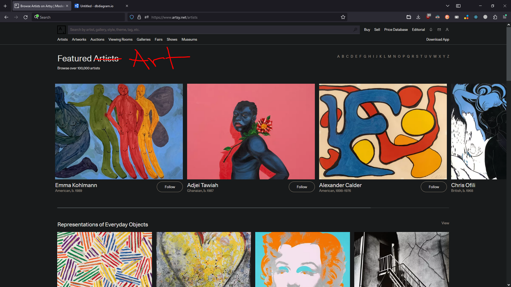
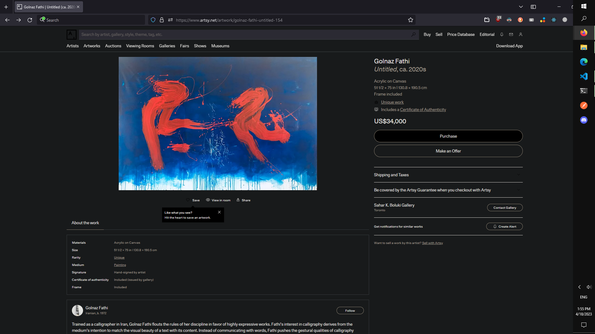
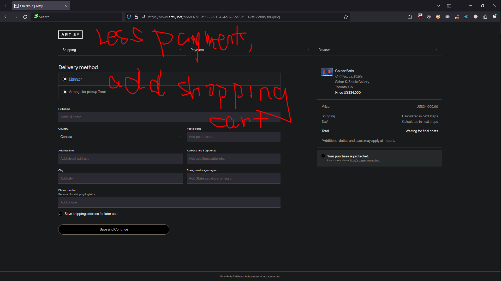
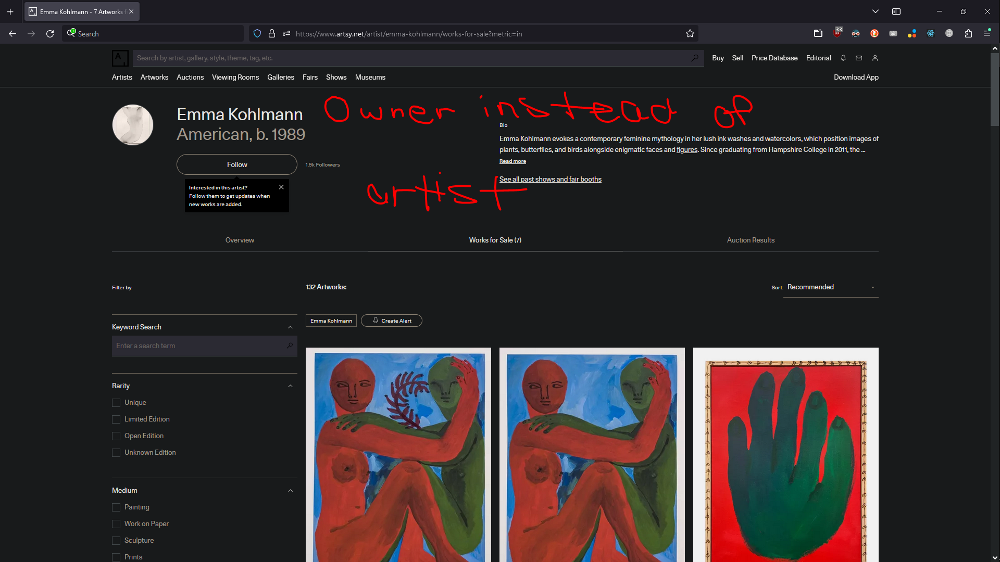

# CasualInk
CasualInk is for buying, selling, and auctioning off art pieces that you create, or own.

## Technologies Used

### Languages

- JavaScript
- HTML
- CSS
- DBML
- Python

### Frameworks
- React
- Flask

### Libraries
- Redux
- SQLAlchemy

### Databases
- SQLite3
- SQLAlchemy

### Tools
- Postman
- GitHub
- Visual Studio Code
- Redux Developer Tools

## Features
### Artworks
- As an unregistered user, I should be able to view limited information about uploaded artwork
- As a registered user, I should be able to view, create, edit and delete artworks others can see.

### Art Pieces
- Pages:
  * /artists
  * /artists/:artistId/artwork
- As an unregistered user, I won't have access to this feature.
- As a registered and logged in user:
  * I want to be able to create listings/upload artwork for sale/auction.
  * I want to be able to edit the listing information.
  * I want to be able to view art listings from other people.
  * I want to be able to delete my art listings.

### Shopping Cart
- Pages:
  * /
  * /curr/shopping-cart
  * /collection
  * /collection/:artworkId
- As an unregistered user, I want to be able to view a simple splash page, with some highlight art pieces, and a sign up/login as a new user to see more info.
- As a registered and logged in user:
  * I want to be able to access and view my shopping cart.
  * I want to be able to add items to my shopping cart.
  * I want to be able to remove items from my shopping cart.
  * I want to be able to delete/remove all items from my shopping cart.

### Reviews
- As an unregistered user, I won't have access to this feature.
- As a registered and logged in user:
  * I will have a /profile page, and be able to view other people's profile pages. These profile pages will have a tab for leaving reviews/comments about each user. Customer's can then leave comments regarding their experience with a particular seller.
  * I want to be able to create a comment on other user profiles, as well as view/like other people's comments.
  * I want to be able to edit a past comment.
  * I want to be able to delete a past comment.

### Live Bidding
- As an unregistered user, I won't have access to this feature.
- As a registered and logged in user:
  * I want to be able to click on a button to bid on an auction, and set m.
  * I want to be able to see the auction price update live when someone makes a new bid.
  * I won't be able to bid a lower price than the current highest bid price.
  * I want to be able to take an auction listing down on auction deadline/end auction early.

### Ratings
- As an unregistered user, I want to be able to see ratings for a seller/owner
- As a registered user, I want to be able to rate, and update my rating.

## Database Design

## Backend Routes
### Users
- GET /api/users/
  * Returns information for all users
- GET /api/users/:userId
  * Return information for one user

### Sessions
- GET /api/auth/
  * Returns the information for the logged in user
- POST /api/auth/signup
  * Signs a new user up
- POST /api/auth/login
  * Logs in a user
- DELETE /api/auth/
  * Logs out a user

### Artwork
- GET /api/owner/:ownerId
  * Get all artwork by a specific owner
- POST /api/artworks/new
  * Upload a new artwork
- PUT /api/artworks/:artworkId
  * Edit information for a specific artwork
- DELETE /api/artworks/:artworkId
  * Delete an artwork from an owner

### ArtworkListings
- GET /api/collections
  * Returns all listings for available artworks on sale
- GET /api/artworks/:artworkId/artlistings/:artlistingId
  * Returns a single listing
- POST /api/artworks/:artworkId/artlistings/:artlistingId
  * Create a new listing item
- PUT /api/artworks/:artworkId/artlistings/:artlistingId
  * Edit information for a listing
- DELETE /api/artworks/:artworkId/artlistings/:artlistingId
  * Delete a listing after the item is sold

## Wireframes
### SplashPage/Home

### Login

### Signup

### Collections

### Single Listing

### Shopping Cart

### Profile Page

